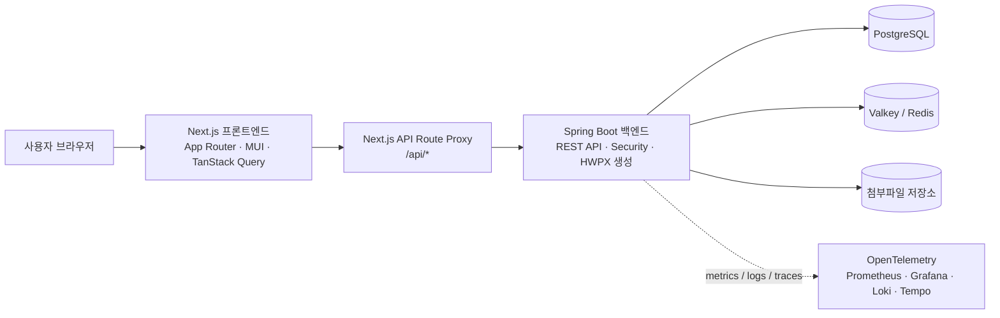
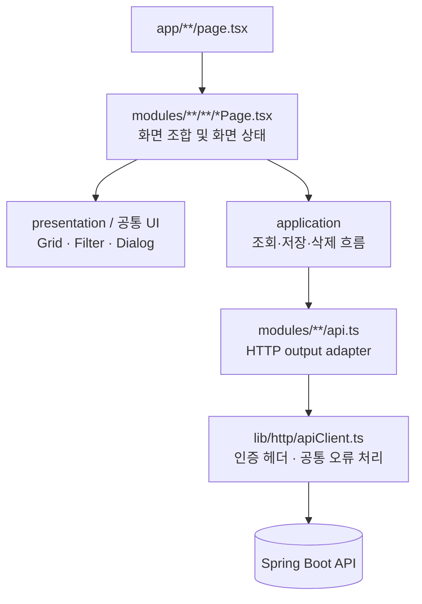
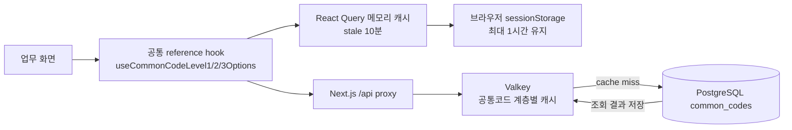
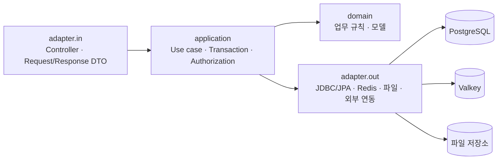
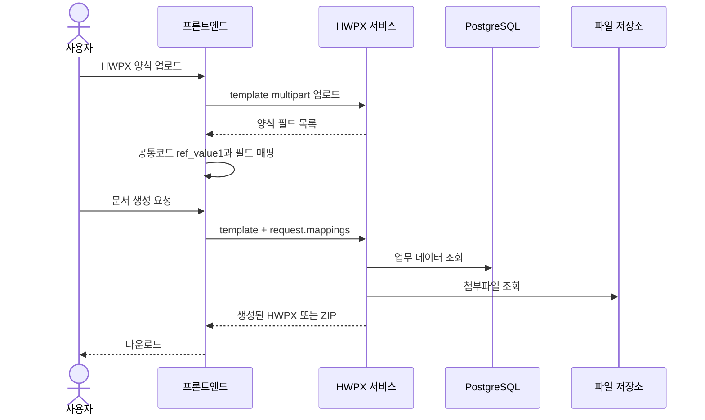

# PQ System

입찰·PQ(Project Qualification) 업무를 한 곳에서 관리하기 위한 웹 애플리케이션입니다. 기술인, 회사 실적, 공사 개요, 업무중복도, 입찰 공고와 문서 생성을 연결해 입찰 서류를 준비하고 검토하는 흐름을 지원합니다.

## 프로젝트 구성

```text
pq-system/
├─ cheil_fe/              # Next.js 기반 웹 프론트엔드
├─ cheil_be/              # Spring Boot 기반 업무 API
└─ cheil-platform-infra/  # Kubernetes, Helm, Jenkins, Argo CD 운영 구성
```

관련 인프라 저장소: [cheil-platform-infra](https://github.com/lutae2000/cheil-platform-infra)

## 주요 기능

- 대시보드와 입찰 공고 관리
- 기술인 기본정보, 자격, 경력 및 기술 실적 관리
- 회사 실적·용역 실적·유사 실적 관리
- 공사 종류와 공사 개요 관리
- 계약 및 업무중복도 관리
- PQ 참여 기술인 선정과 배치
- PDF 기반 기술인 실적 검토 및 단계별 데이터 정리
- HWPX 양식 업로드, 공통코드 기반 필드 매핑, 문서 일괄 생성
- 회사 실적 증명서와 계약서·참여자 명단 문서 생성
- 메뉴·역할·사용자·권한 관리
- 교육 이력과 알림 관리
- 공통코드, 본사, 부서, 거래처, 자격증 관리
- PostgreSQL, Valkey, Prometheus, Grafana, Loki, Tempo를 이용한 운영 및 관측성

## 전체 아키텍처



프론트엔드는 브라우저에서 `/api`를 호출하고, `cheil_fe/app/api/[[...path]]/route.ts`가 백엔드로 요청을 전달합니다. 이 프록시는 서버 환경변수의 `NEXT_API_BASE_URL`을 사용하고, `NEXT_API_KEY`와 `NEXT_SERVICE_ID`를 서버 측에서 주입해 브라우저에 내부 API 설정을 노출하지 않습니다.

## 프론트엔드 아키텍처

`cheil_fe`는 Next.js App Router와 React 기반으로 구성되어 있습니다.



주요 기술은 다음과 같습니다.

| 영역 | 사용 기술 |
| --- | --- |
| Framework | Next.js 16 App Router |
| UI | React 19, MUI |
| Grid | MUI X Data Grid 기반 `EnterpriseDataGrid` |
| Server state | TanStack Query |
| Client state | Zustand |
| Language | TypeScript |
| Package manager | npm |

공통 reference 조회는 `modules/common/reference`의 API와 hook을 우선 사용합니다. 메뉴별 권한, 탭 상태, 열린 화면 유지, 전역 Snackbar, 공통 Grid를 공통 레이어에서 관리합니다.

### 공통코드 캐싱

공통코드는 여러 화면에서 반복적으로 사용하는 조회 데이터이므로 프론트엔드와 백엔드에 각각 캐시 계층을 둡니다.



프론트엔드에서는 `useCommonCodeLevel1Options`, `useCommonCodeLevel2Options`, `useCommonCodeLevel3Options`, `useCommonCodeGroupOptions`가 공통 진입점입니다. query key에 계층, 상위 코드, 조회 조건, 정렬 조건을 포함해 서로 다른 옵션 조회가 섞이지 않도록 하고, 동일한 조건의 화면에서는 React Query 결과를 공유합니다.

- React Query의 공통코드 reference `staleTime`: 10분
- 브라우저 `sessionStorage` 캐시 보관 시간: 최대 1시간
- 저장 대상: `references/common-codes` query만 선별해 직렬화
- 탭이 비활성 상태이거나 상위 코드가 준비되지 않은 경우 불필요한 조회를 실행하지 않음
- 공통코드 관리 화면에서 저장·수정·삭제가 완료되면 관련 reference query를 무효화
- 로그아웃 시 브라우저에 저장된 reference 캐시를 제거

백엔드에서는 Valkey를 Spring Cache 저장소로 사용합니다. 자주 쓰는 공통코드 조회는 다음 세 가지 캐시로 분리됩니다.

| 캐시 영역 | 키 예시 | 용도 |
| --- | --- | --- |
| `commonCodeById` | `cache:common-codes:by-id:{codeId}` | 코드 ID 단건 조회 |
| `commonCodeLevel1` | `cache:common-codes:level1:{level1Code}` | 1단계 코드 기준 하위 목록 |
| `commonCodeLevel2` | `cache:common-codes:level1:{level1Code}:level2:{level2Code}` | 1·2단계 코드 기준 목록 |

공통코드 캐시의 기본 TTL은 1일이며 `APP_COMMON_CODE_CACHE_TTL` 환경변수로 조정할 수 있습니다. `bypassCache=true` 요청은 캐시를 사용하지 않고 데이터베이스를 직접 조회하므로 공통코드 관리 화면에서 최신값을 확인하거나 캐시 문제를 진단할 때 사용할 수 있습니다. Valkey 조회·저장·삭제 오류는 애플리케이션의 원본 데이터 조회를 막지 않도록 전용 cache error handler가 기록하고 넘어갑니다.

공통코드가 추가·수정·삭제되면 백엔드는 변경된 코드의 ID 캐시와 계층별 목록 캐시를 함께 제거합니다. 수정 시에는 변경 전·후 코드 경로를 모두 무효화해 상위 코드나 `ref_value1`이 바뀐 경우에도 이전 옵션이 남지 않게 합니다. 프론트엔드는 같은 시점에 `references/common-codes` query를 무효화하므로 다음 조회에서 백엔드의 최신 공통코드를 다시 가져옵니다.

## 백엔드 아키텍처

`cheil_be`는 Spring Boot 4.1과 Java 25를 사용하며, 업무 기능은 다음 계층 방향을 따릅니다.



주요 백엔드 기술은 Spring Web, Spring Security, Spring Data JPA, Querydsl, Flyway, PostgreSQL, Valkey, PDFBox, Tabula, Actuator, Micrometer, OpenTelemetry입니다. API 문서는 REST Docs 테스트에서 생성합니다.

## HWPX 문서 생성

HWPX 생성은 화면에서 양식을 업로드하고, 공통코드의 `ref_value1`을 기준으로 필드 경로를 매핑하는 방식입니다.



기술인 실적은 `PQ/HG`(기본), `PQ/HH`(경력), `PQ/HI`(이력), 회사 실적과 업무중복도는 각 화면의 PQ 공통코드 그룹을 사용합니다. 선택적 데이터나 첨부파일이 없는 행은 문서 전체 생성이 실패하지 않도록 빈 값 또는 제외 가능한 목록으로 처리합니다.

### 자동화 대상과 출력 문서

| 업무 영역 | 자동으로 채우는 항목 | 출력 |
| --- | --- | --- |
| 기술인 실적 | 기술인 기본정보, 성명·사번·부서·직위, 생년월일·나이, 학력·자격증, 재직·경력, 실적의 공사명·발주처·금액·참여기간·참여분야·직급 | 선택 기술인별 실적증명서 HWPX, 여러 기술인의 ZIP |
| 회사 실적 | 회사 실적의 공사명·공사개요·발주처·계약금액, 계약기간, 지분율, 공사 종류와 화면에서 정렬한 대상 순서 | 여러 회사 실적을 합친 HWPX |
| 업무중복도 | 기술인별 계약번호·용역명·발주처·용역종류, 계약금액·지분금액, 착공·준공·중지기간, 잔여기간, 공동도급 비율 | 기술인별 계약서 HWPX ZIP, 계약서+참여자명단 HWPX ZIP |
| 첨부 증빙 | 실적증명서, 계약서, 참여자명단의 첨부 PDF·JPG·PNG | 이미지 페이지를 포함한 HWPX 또는 ZIP |

### 양식 필드 매핑 방식

HWPX는 양식 셀의 `name` 속성을 필드명으로 사용합니다. 사용자가 양식을 업로드하면 백엔드가 HWPX 압축 파일의 `Contents/section*.xml`을 분석해 양식에 존재하는 필드 목록을 반환합니다. 프론트엔드는 이 목록을 PQ 공통코드의 `code_detail_name`, `code_name`, `level3_code`와 비교하고, 공통코드의 `ref_value1`을 실제 데이터 경로로 사용합니다.

예를 들면 다음과 같이 필드명과 데이터 경로를 분리합니다.

| 필드 의미 | `ref_value1` 경로 | 설명 |
| --- | --- | --- |
| 기본정보의 성명 | `summary.name` | 현재 기술인 기본정보 |
| 경력 용역기간 | `row.contractTerm` | 경력 반복 행의 계약기간 |
| 경력 참여기간 | `row.workTerm` | 경력 반복 행의 실제 참여기간 |
| 참여분야·직위 | `row.jobClass` | 경력 반복 행의 업무 분류와 직위 |
| 참여 차수 기간 | `row.participationPeriods` | 여러 참여기간의 표시용 값 |
| 회사 실적 공사명 | `row.jobName` | 회사 실적 반복 행 |
| 업무중복도 계약번호 | `row.contractNo` | 계약서 반복 행 |

필드명에 날짜 형식, 금액 단위, 기간 단위가 포함된 경우에도 경로를 새로 만들지 않습니다. 예를 들어 `경력_용역기간(yyyy-mm-dd)(일)`은 `row.contractTerm`으로 매핑하고, 백엔드 formatter가 원래 필드명을 해석해 날짜 형식과 일·월·년 단위를 계산합니다. 이 구조 덕분에 화면 코드나 문서 생성 서비스에 업무 필드명을 하드코딩하지 않고 공통코드 설정만으로 양식을 확장할 수 있습니다.

허용되는 매핑 루트는 다음과 같습니다.

```text
basic.*    기술인 기본·학력·자격증 값
detail.*   기술인 상세 값
summary.*  문서 상단의 요약 값
row.*      반복되는 실적·계약·회사 실적 행
history.*  회사 경력 이력 반복 행
```

### 반복 행과 HWPX XML 처리

문서 생성기는 단순 문자열 치환에 그치지 않고 HWPX XML 구조를 유지하면서 다음 작업을 수행합니다.

1. 양식 안에서 `row.*` 또는 `history.*` 매핑이 들어간 표 행을 찾습니다.
2. 조회된 실적·경력·계약 데이터 수만큼 양식 행을 복제합니다.
3. 각 복제 행의 셀 이름과 매핑 경로에 맞춰 값을 입력합니다.
4. 표의 `rowCnt`, 셀 행 주소와 표 높이를 새 행 수에 맞게 보정합니다.
5. 기존 빈 셀의 캐시된 줄 배치 정보를 제거해 긴 값이나 여러 줄 값이 겹치지 않도록 합니다.
6. 생성된 XML과 나머지 HWPX 압축 엔트리를 다시 묶어 다운로드 가능한 문서를 반환합니다.

### 값 변환과 표시 규칙

- 날짜: `yyyy-MM-dd`, `yyyy.MM.dd`, `yyyy년MM월`, `yy.MM.dd` 같은 필드명 형식을 기준으로 변환
- 기간: 시작일·종료일을 사용해 전체 기간을 일·개월·년 단위로 계산
- 금액: 계약금액·지분금액을 원 단위 또는 백만 원 단위로 변환하고 천 단위 구분 기호 적용
- 비율: 공동도급 및 지분율을 양식 필드 형식에 맞춰 표시
- 나이: 생년월일 기준으로 생성 시점의 나이 계산
- 여러 차수: 각 참여기간을 줄바꿈으로 표시하고 전체 기간을 함께 계산
- 한 줄 필드: 필드명에 `xx`가 포함되면 줄바꿈을 제거해 한 줄로 출력
- 선택값: 데이터가 없거나 선택 컬럼이 `null`이면 빈 문자열로 처리

### 첨부파일과 일괄 생성

실적 또는 계약 대상 ID를 한 번에 전달하고, 백엔드는 `owner_type`과 `owner_id IN (...)` 조건으로 첨부파일을 일괄 조회합니다. 이후 대상별 첨부파일을 그룹화해 필요한 유형만 문서에 포함합니다.

첨부파일이 없는 대상이 섞여 있어도 파일이 존재하는 대상의 문서는 계속 생성합니다. 저장소에서 특정 파일을 찾지 못한 경우에도 해당 파일만 건너뛰며, 전체 ZIP 생성을 중단하지 않습니다. 최종적으로 실제 문서를 하나도 만들 수 없는 경우에만 사용자에게 첨부파일 없음 오류를 반환합니다.

문서 생성 API는 다음과 같이 구분됩니다.

| API | 용도 |
| --- | --- |
| `POST /pq/engineer-performance-docs/hwpx/inspect` | 업로드한 HWPX에서 필드명 추출 |
| `POST /pq/engineer-performance-docs/hwpx/generate` | 기술인 실적 데이터를 매핑해 HWPX ZIP 생성 |
| `POST /pq/engineer-performance-docs/performance-certificates/generate` | 회사 실적 증명서 HWPX 생성 |
| `POST /pq/engineer-performance-docs/performance-certificates/generate-batch` | 기술인별 실적증명서 ZIP 생성 |
| `POST /pq/company-performance-document-targets/hwpx/generate` | 선택 회사 실적을 하나의 HWPX로 생성 |
| `POST /work-overlap-docs/hwpx/template/generate` | 사용자 양식 기반 업무중복도 HWPX 생성 |
| `POST /work-overlap-docs/hwpx/generate` | 계약서 또는 계약서+참여자명단 ZIP 생성 |

## CI/CD 구성

개발 배포는 `cheil-platform-infra`의 Jenkins Pipeline과 Kubernetes 기반 Argo CD를 사용합니다.

```mermaid
flowchart LR
    commit[Git push\npq-system]
    jenkins[Jenkins\nKubernetes agents]
    validate[검증 및 빌드\nGradle · npm · Helm lint]
    buildkit[BuildKit\nBackend / Frontend 이미지 빌드]
    ghcr[(GitHub Container Registry)]
    updater[Argo CD Image Updater]
    argocd[Argo CD\nHelm Application]
    rollout[Argo Rollouts\nBlue-Green 배포]
    k8s[Kubernetes\nmerp namespace]

    commit --> jenkins
    jenkins --> validate
    validate --> buildkit
    buildkit --> ghcr
    ghcr --> updater
    updater --> argocd
    argocd --> rollout
    rollout --> k8s
```



배포 흐름은 다음과 같습니다.

1. Jenkins가 애플리케이션 저장소와 인프라 저장소를 checkout합니다.
2. Helm chart를 lint하고 렌더링하며, 선택된 컴포넌트의 백엔드 또는 프론트엔드를 빌드합니다.
3. BuildKit이 커밋의 짧은 SHA를 이미지 태그로 사용해 `merp-backend`, `merp-frontend` 이미지를 GHCR에 push합니다.
4. Argo CD Image Updater가 7자리 SHA 태그를 감지해 `merp-de` Application의 Helm image tag를 갱신합니다.
5. Argo CD가 Helm chart를 동기화하고 Argo Rollouts가 blue-green 방식으로 배포합니다.
6. Kubernetes readiness/liveness probe와 백엔드 health analysis를 통과한 뒤 트래픽을 새 버전으로 전환합니다.

Jenkins Pipeline은 `All`, `Backend`, `Frontend` 컴포넌트 선택과 `PUSH_IMAGES` 옵션을 제공합니다. 인프라 저장소는 Jenkins가 직접 수정하지 않고 Argo CD와 Image Updater가 배포 상태를 반영합니다.

## 로컬 개발

### 사전 요구사항

- Node.js 24 이상
- npm
- Java 25
- Docker Desktop 또는 Docker Engine
- PostgreSQL, Valkey

### 프론트엔드

```bash
cd cheil_fe
npm ci
npm run dev:local
```

기본 개발 서버는 `http://localhost:5000`에서 실행됩니다. `.env.local`에 백엔드 주소와 서비스 인증 설정을 구성합니다.

```dotenv
NEXT_API_BASE_URL=http://localhost:8080
NEXT_API_KEY=<local-api-key>
NEXT_SERVICE_ID=application
NEXT_PUBLIC_APP_PROFILE=local
NEXT_PUBLIC_ROUTE_GUARD_ENABLED=true
```

주요 명령어:

```bash
npm run lint
npm run build
npm run start
npm run storybook
npm run generate:page-registry
```

### 백엔드 및 지원 서비스

```bash
cd cheil_be
./gradlew test
./gradlew bootJar
```

로컬 PostgreSQL과 Valkey는 백엔드 저장소의 Docker Compose 구성을 사용할 수 있습니다.

```bash
docker compose -f docker/local/compose.infra.yaml up -d
docker compose -f docker/local/compose.observability.yaml up -d
```

애플리케이션 프로파일, 데이터베이스 접속 정보, 파일 저장 경로, API 키와 토큰 시크릿은 환경변수 또는 로컬 전용 설정으로 주입합니다. 실제 비밀값은 저장소에 커밋하지 않습니다.

## 운영 관측성

- Prometheus: 애플리케이션과 인프라 메트릭 수집
- Grafana: Spring Boot, PostgreSQL, Valkey, 컨테이너 대시보드
- OpenTelemetry Collector: trace 수집 및 전달
- Tempo: 분산 trace 저장
- Loki: 로그 저장 및 trace ID 연계
- Actuator: health와 Prometheus endpoint 제공

로컬 또는 개발 환경에서 서비스 상태를 확인할 때는 백엔드의 `/actuator/health`와 `/actuator/prometheus`, Grafana의 Explore 및 대시보드를 함께 확인합니다.

## 디렉터리 안내

| 경로 | 설명 |
| --- | --- |
| `cheil_fe/app` | Next.js App Router 진입점과 API proxy |
| `cheil_fe/components` | 공통 레이아웃과 UI 컴포넌트 |
| `cheil_fe/modules` | 업무별 화면, API, application 로직 |
| `cheil_fe/lib` | HTTP, 인증, provider, 공통 설정 |
| `cheil_be/adapter` | HTTP·DB·Redis·파일 입출력 adapter |
| `cheil_be/application` | use case와 application service |
| `cheil_be/domain` | 업무 모델과 규칙 |
| `cheil_be/src/main/resources/db/migration` | Flyway 데이터베이스 migration |
| `cheil-platform-infra/helm` | PostgreSQL, Valkey, 관측성, MERP Helm chart |
| `cheil-platform-infra/bootstrap` | Kubernetes·Jenkins·Argo CD 설치 및 환경 구성 |
| `cheil-platform-infra/jenkins` | CI/CD Pipeline과 build image 구성 |

## 라이선스 및 보안

이 프로젝트는 사내 업무 시스템 용도로 관리됩니다. 저장소 공개 범위와 배포 환경의 비밀값을 분리하고, API key·토큰·비밀번호·TLS private key는 환경변수나 Kubernetes Secret으로 관리합니다.
